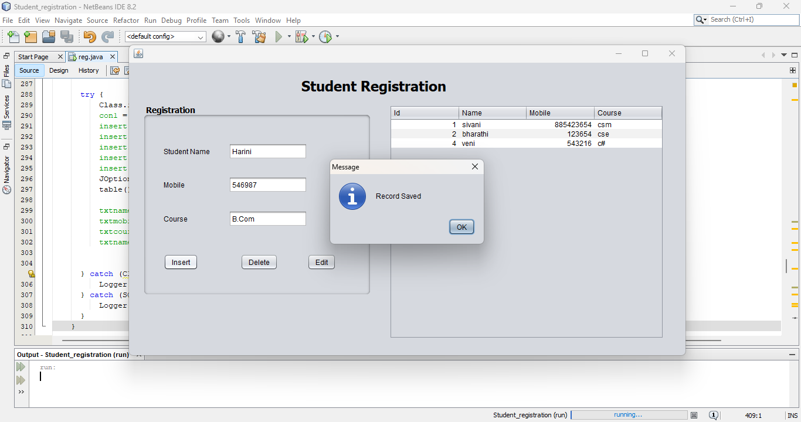
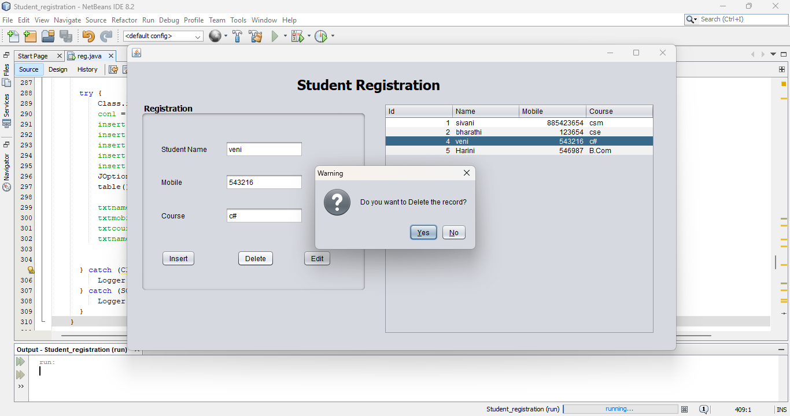
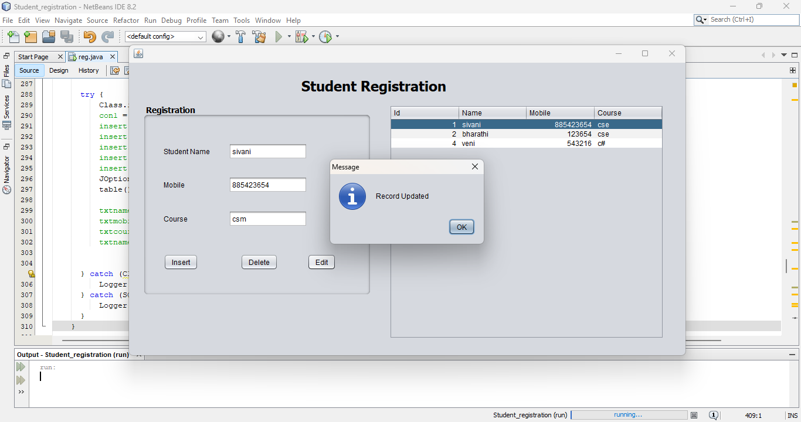
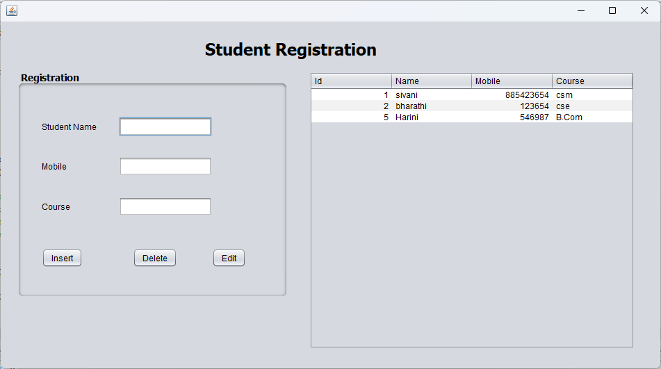

# 🎓 Student Registration System

A simple **Java Swing** application integrated with **MySQL** (via **phpMyAdmin**) that allows users to **add**, **edit**, **delete**, and **view** student records in a structured database. It also displays confirmation dialogs for safer actions and success messages after each operation.

---

## ✨ **Features**

- ➕ **Add** new student records
- ✏️ **Edit** existing student details
- 🗑️ **Delete** student records with warning dialog
- 📋 **View** all students in a dynamic table
- 🔐 MySQL database integration for persistent storage
- ✅ Dialog boxes for:
  - ⚠️ Delete confirmation
  - 💾 Record saved
  - ♻️ Record updated
  - ❌ Record deleted

---

## 🛠️ **Tech Stack**

| Component     | Technology                         |
|----------------|-------------------------------------|
| Language       | Java                                |
| UI             | Java Swing                          |
| Database       | MySQL (via phpMyAdmin)              |
| Connectivity   | JDBC (Java Database Connectivity)   |
| IDE            | NetBeans / IntelliJ IDEA            |
| Server Tool    | XAMPP (for running phpMyAdmin)      |

---

## 🗃️ **Database Setup**

1. Start **XAMPP** and run **Apache** & **MySQL** services.
2. Open **phpMyAdmin** at [http://localhost/phpmyadmin](http://localhost/phpmyadmin).
3. Create a new database named: `student_database`.
4. Run the following SQL query to create the required table:

```sql
CREATE TABLE `record` (
  `Id` INT NOT NULL AUTO_INCREMENT,
  `Name` VARCHAR(255),
  `Mobile` VARCHAR(15),
  `Course` VARCHAR(255),
  PRIMARY KEY (`Id`)
);

## 📸 **Screenshots**

Here are a few snapshots of the application to showcase its functionality:

### 🖼️ Add Student Form
A simple form to input student details like Name, Mobile, and Course.



---

### 📋 Student List Table
Dynamically displays all students stored in the database.


---

### ⚠️ Delete Confirmation Dialog
Confirmation dialog before a record is deleted to avoid accidental removals.



---

### ♻️ Record Updated Dialog
Shows that student details were updated successfully.



---

### ❌ After Record  Has Been Deleted Dialog
Displays the table after deleting the record.


